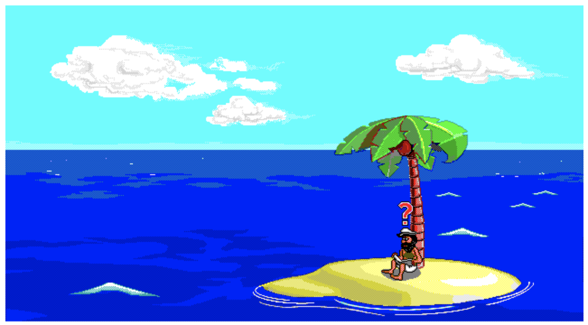

# castaway

The aim of this project is to provide a complete re-implemtation of the Johnny Castaway Screen Saver created by Dynamix using Javascript.

## Live Demo

[Check here the current development state](http://castaway.xesf.net/#entry=MJFISH.TTM)

## Purpose
- Re-implementation of the Johnny Castaway Screen Saver;

- Learn the Dynamix Game Development System (DGDS);

- Document the files format used;

- Dump tools using NodeJS;

- Focus on taking advantage of the modern web development languages and the usage of ES modules;

- Have fun implementing it!!

## Enhancements

List of new features to add to Johnny Castaway experience:
* Day/Night loop in 24h instead of 8h
* Day/Night based on user location sunrise and sunset
* Moving cloulds
* Add waves like the static screen
* Accelarate time
* Tides based on user locations with real time coutry low tide info
* Play Full Story Sequence
    * Choose single activities to play
* Number of full complete stories played worldwide
* Total hours worldwide played
* Statistics per Activity
    * Total Jogging
    * Fishing
    * etc.
* Extend festive days from the original - could be based on user location

## Documents

[Resource Index File Format](docs/resindex.md)

## Usage

Create a "data" folder in the src directory and place the original files.
* SCRANTIC.SCR
* RESOURCE.MAP
* RESOURCE.001

Install:
* http-server (you can use "brew install http-server")

### Run Johnny Castaway

Run this commands in the root folder:

> cd src

> http-server -c-1

> open localhost:8080

### Dump Resources

This application allows you to extract the resources of Johnny Castaway. A data/dump folder will be created when application is executed.

> cd src

> chmod +x ./dump.mjs

> ./dump.mjs
